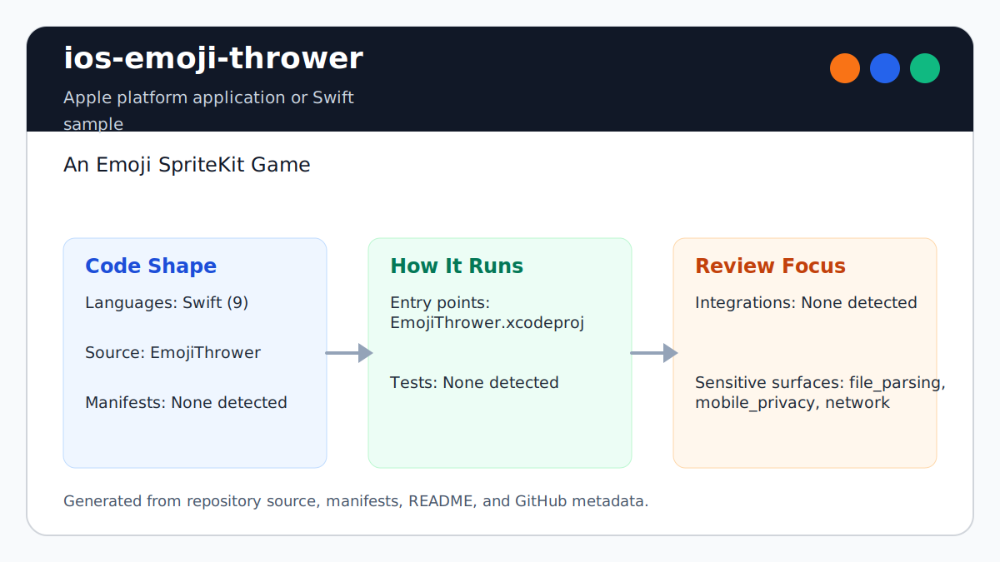

# ios-emoji-thrower

<!-- README-OVERVIEW-IMAGE -->


## Overview

`garethpaul/ios-emoji-thrower` is a Swift 5 SpriteKit game sample in which the
player launches emoji projectiles at moving targets.

This README is based on the checked-in source, manifests, scripts, and repository metadata on the `master` branch. The project language mix found during review was: Swift (9).

## Repository Contents

- `CHANGES.md` - concise history of maintenance changes
- `README.md` - project overview and local usage notes
- `EmojiThrower` - Swift gameplay source, scenes, assets, sounds, and app metadata
- `EmojiThrower.xcodeproj` - Xcode project file
- `Makefile` - local verification entry point
- `SECURITY.md` - security reporting and disclosure guidance
- `scripts/check-baseline.py` - static SpriteKit resource and source verifier
- `VISION.md` - project direction and maintenance guardrails

Additional scan context:

- Source directories: EmojiThrower
- Dependency and build manifests: none detected
- Entry points or build surfaces: `make check`, EmojiThrower.xcodeproj
- Test-looking files: no obvious test files detected

## Getting Started

### Prerequisites

- Git
- macOS with Xcode for building Apple platform projects
- Python 3 for local static verification on non-macOS hosts

### Setup

```bash
git clone https://github.com/garethpaul/ios-emoji-thrower.git
cd ios-emoji-thrower
make lint
make test
make build
make check
```

The checked-in project has no external dependency manifest. Use Xcode for
interactive builds; `make check` runs static verification everywhere and an
unsigned simulator build when Xcode is available.

## Running or Using the Project

- Open `EmojiThrower.xcodeproj` in Xcode, choose the app or sample scheme, and run it on the matching simulator/device.
- The game uses SpriteKit scene logic, bundled image resources, sound files, and `Sketch3D.otf`.
- Win and loss paths share a guarded game-over presenter so contacts do not trigger repeated scene transitions.
- Game-over restarts confirm the current scene before presenting a fresh game scene.
- Collision handlers ignore late callbacks after game-over presentation begins.
- The game-over presenter clears the physics contact delegate before scene transition.
- Enemy spawning is keyed and stopped when game-over presentation starts.
- Background scroll movement advances per-frame from each node's current
  position until game over.
- This is a local game sample. Do not add accounts, analytics, persistence, upload, or network behavior without a dedicated design and security review.

## Testing and Verification

Run the local static baseline:

```bash
make lint
make test
make build
make check
```

GitHub Actions runs `make check` through `.github/workflows/check.yml` on
pushes, pull requests, and manual dispatches.

The `lint`, `test`, and `build` targets intentionally alias the canonical baseline
on hosts without Xcode, so the standard local gate commands
stay available while preserving the single source of truth.

The baseline runs `scripts/check-baseline.py`, parses plist/storyboard/asset metadata, validates the binary SpriteKit scene plist, checks Xcode resource references, verifies the Swift source inventory, and guards against image-helper force unwraps, non-finite touch vectors, repeated game-over transitions, unguarded game-over restarts, late collision handler mutations, uncleared contact delegate callbacks, late spawn actions, broken per-frame background scroll movement, debug logging, network, analytics, upload, or persistence behavior.

The pinned GitHub Actions check runs `make check` on `macos-15`. When Xcode is
available, the baseline also compiles an unsigned Swift 5 Debug build for the
iOS Simulator. It does not launch SpriteKit gameplay, render frames, play audio,
or run physics simulation.

For runtime verification on macOS, launch the game in a simulator and exercise
projectiles, collisions, game-over transitions, and restart behavior.

When the required SDK or runtime is unavailable, use static checks and source review first, then verify on a machine that has the matching platform toolchain.

## Configuration and Secrets

- No required secret or credential file was identified in the repository scan. If you add integrations later, keep secrets out of git.

## Security and Privacy Notes

- Review changes touching network requests, sockets, or service endpoints; examples from the scan include EmojiThrower/Info.plist.
- Review changes touching mobile permissions or privacy-sensitive device data; examples from the scan include EmojiThrower/GameScene.swift.
- Review changes touching file, media, JSON, XML, CSV, OCR, or data parsing; examples from the scan include EmojiThrower/GameScene.swift, EmojiThrower/Info.plist.
- Debug logging from launch and gameplay paths should stay removed; score should remain visible in-game rather than printed to the console.
- Runtime debug overlays should stay disabled outside explicit troubleshooting builds.
- Resource changes should keep image, sound, font, scene, and Xcode project references aligned, with fallback behavior for optional image helper rendering.
- Enemy spawning skips invalid or undersized scene geometry before constructing
  a random range or adding a SpriteKit node.

## Maintenance Notes

- This is an Apple platform sample. Keep Xcode, Swift, and the deployment target
  aligned with the checked-in project settings.
- See `SECURITY.md` for vulnerability reporting and safe research guidance.
- See `VISION.md` for project direction and contribution guardrails.
- See `docs/plans/2026-06-09-background-scroll-position.md` for the background scroll position guardrail.
- See `docs/plans/2026-06-09-background-scroll-update.md` for the per-frame background scroll guardrail.
- See `docs/plans/2026-06-09-collision-handler-game-over-guard.md` for the collision handler guardrail.
- See `docs/plans/2026-06-09-contact-delegate-game-over-guard.md` for the contact delegate game-over guardrail.
- See `docs/plans/2026-06-10-game-over-restart-guard.md` for the game-over restart guardrail.
- See `docs/plans/2026-06-13-undersized-scene-spawn-guard.md` for the enemy
  spawn geometry guardrail.
- See `docs/plans/2026-06-09-make-gate-aliases.md` for the local gate alias guardrail.
- See `docs/plans/2026-06-10-ci-baseline.md` for the GitHub Actions baseline.
- See `docs/plans/2026-06-10-hosted-project-validation.md` for the hosted Xcode
  validation boundary.
- See `docs/plans/2026-06-10-swift-5-spritekit-build.md` for the Swift 5
  simulator-build migration.
- Run `make lint`, `make test`, `make build`, and `make check` before pushing changes to Swift sources, plist/storyboard files, SpriteKit assets, sounds, fonts, Xcode metadata, or gameplay/privacy documentation.

## Contributing

Keep changes small and tied to the project that is already present in this repository. For code changes, document the toolchain used, avoid committing generated dependency directories or local configuration, and update this README when setup or verification steps change.
